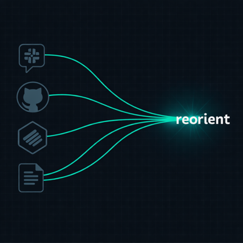

<p align="center"></p>

<p align="center">Beat "weekend amnesia" — pull live context from Linear, GitHub, Google Drive, and Slack into a single briefing, right inside Claude Code.</p>

---

## Quickstart

```bash
git clone https://github.com/prassanna-ravishankar/reorient.git
cd reorient
uv sync
cp .env.example .env   # fill in your tokens (see Auth below)
claude                 # launch Claude Code here
```

Inside Claude Code:

```
/catchup    → re-orient after any break
/standup    → generate today's standup
```

Each skill fetches live data, blends it with memory from past sessions, and returns a tight briefing. No dashboards, no context switching.

---

## Auth

| Source | Setup |
|--------|-------|
| **GitHub** | `gh auth login` |
| **Linear** | `LINEAR_API_KEY` in `.env` — Linear → Settings → API → Personal keys |
| **Google Drive** | [Create OAuth 2.0 Desktop credentials](https://console.cloud.google.com) → save as `~/.reorient/google_credentials.json` → run `uv run python -c "from reorient.drive import auth; auth()"` once |
| **Slack** | `SLACK_USER_TOKEN` in `.env` — requires a custom Slack app with user scopes (`channels:history`, `im:history`, `search:read`, etc.) |

Set `GITHUB_ORG` in `.env` to your organisation name.

---

## Session memory

Reorient uses [memsearch](https://github.com/zilliztech/memsearch) to remember what was flagged across sessions, so `/catchup` on Monday knows what you left open on Friday.

```bash
# Inside Claude Code
/plugin marketplace add zilliztech/memsearch
/plugin install memsearch
```

Then run `memsearch config init` once to configure your embedding provider.

---

## Extending

Adding a new source (e.g. Jira, Notion) takes three steps — see the Implementation Reference in [CLAUDE.md](./CLAUDE.md).
